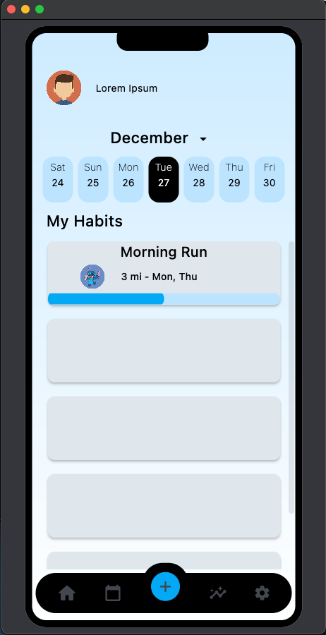
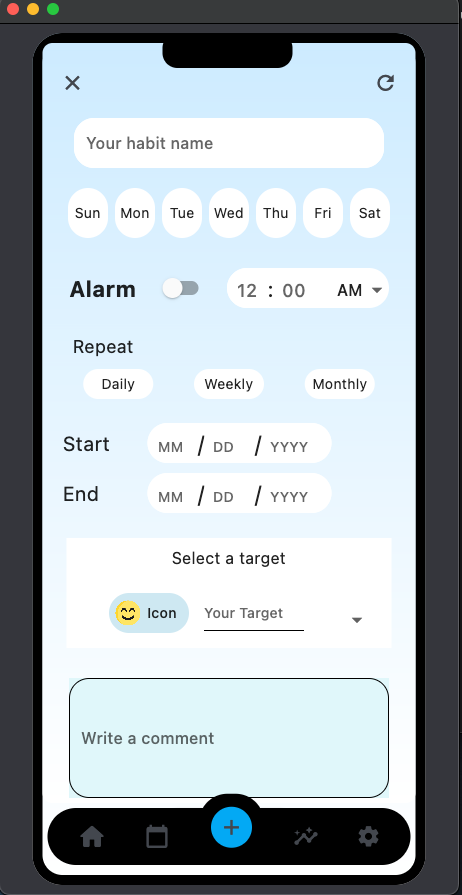
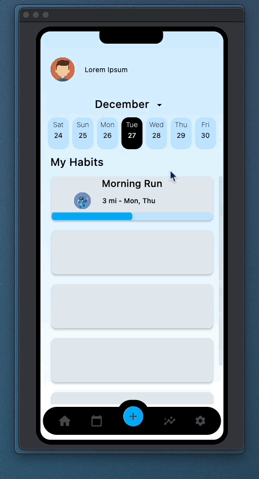

# Fletdev_Mobile_App_Tracker

This is mobile app that allows users keep track of their daily habits and goals. Using the app, users can create a list of habits they want to form or break, set reminders, and then log their progress on a daily basis.
 
Currently being developed, follow this repository to keep track of new updates. Please feel free to fork this project and implement your changes, ideas and suggestions are always welcome.

This mobile app is being developed using the Flet Framework for Python. _Flet enables developers to easily build realtime web, mobile and desktop apps in Python._ For more info. Check out <a href="https://flet.dev/">Flet</a>

!

 

